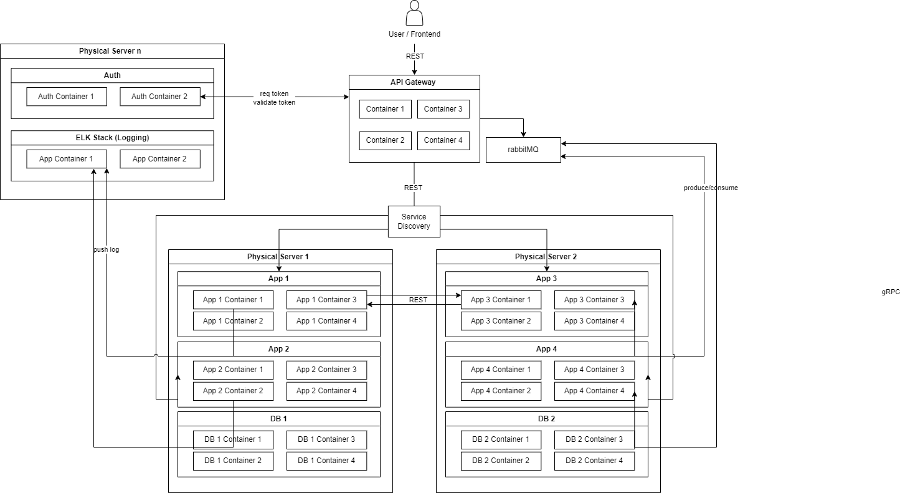
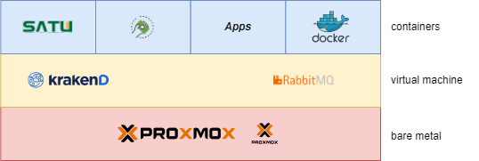
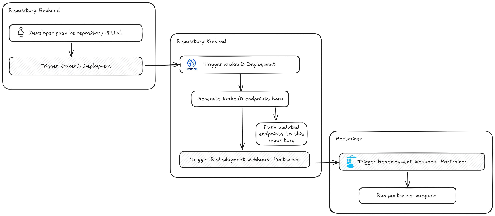

# API Gateway USU - Krakend

## Deskripsi

Repository ini berisi konfigurasi dan implementasi API Gateway untuk Universitas Sumatera Utara (USU) menggunakan [Krakend](https://www.krakend.io/). API Gateway ini digunakan untuk memfasilitasi komunikasi antara berbagai layanan mikro di lingkungan USU, menyediakan routing, logging, monitoring, dan autentikasi.

Docs: [PoC](https://docs.google.com/document/d/1Xp9Idqyx0B2eHBBXeZ3by-QabMIB2jW42waAQY0qEaw/edit?usp=sharing)

## Arsitektur





Deployment Steps


API Gateway ini menggunakan Krakend sebagai gerbang penghubung antara klien dan layanan internal, di mana semua permintaan akan dikirimkan melalui gateway ini. Setiap rute diatur sesuai dengan service endpoint yang diatur di microservices.

## Persyaratan

- [Docker](https://www.docker.com/) dan [Docker Compose](https://docs.docker.com/compose/)
- Krakend CE
- Keycloak untuk autentikasi
- ELK Stack untuk logging (opsional)

## Cara Menjalankan

1. Clone repository ini:

   ```bash
   git clone https://github.com/usu/api-gateway.git
   cd api-gateway
   ```

2. Jalankan dengan Docker Compose:

   ```bash
   docker-compose up
   ```

3. Akses API Gateway di `http://localhost:8080`.

## Kontributor

- **Nama**: [Fikih Firmansyah](https://github.com/fikihfirmansyah)
- **Email**: [fikih@usu.ac.id](mailto:fikih@usu.ac.id)

## Lisensi

Proyek ini dilisensikan di bawah lisensi MIT - lihat file [LICENSE](LICENSE) untuk detail lebih lanjut.
